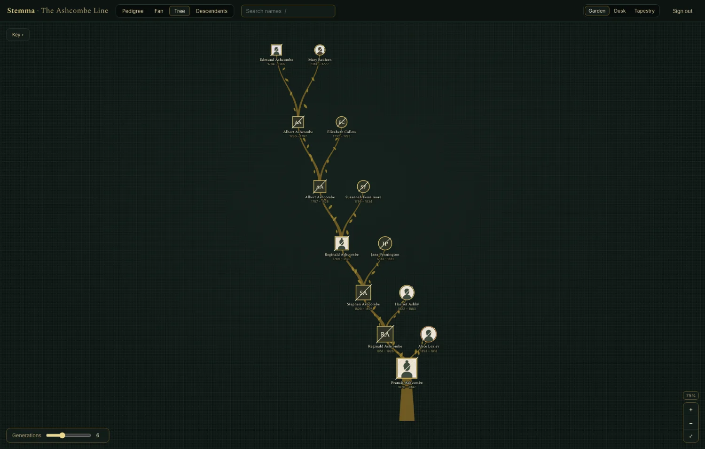
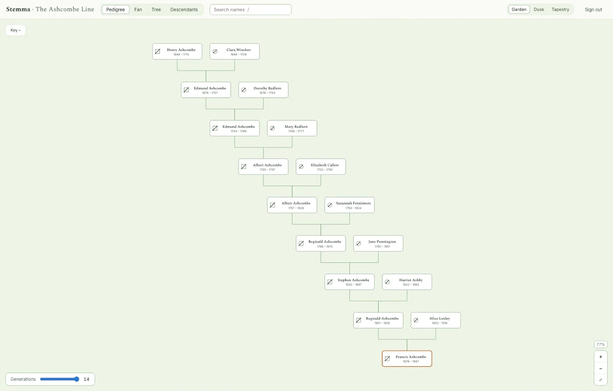
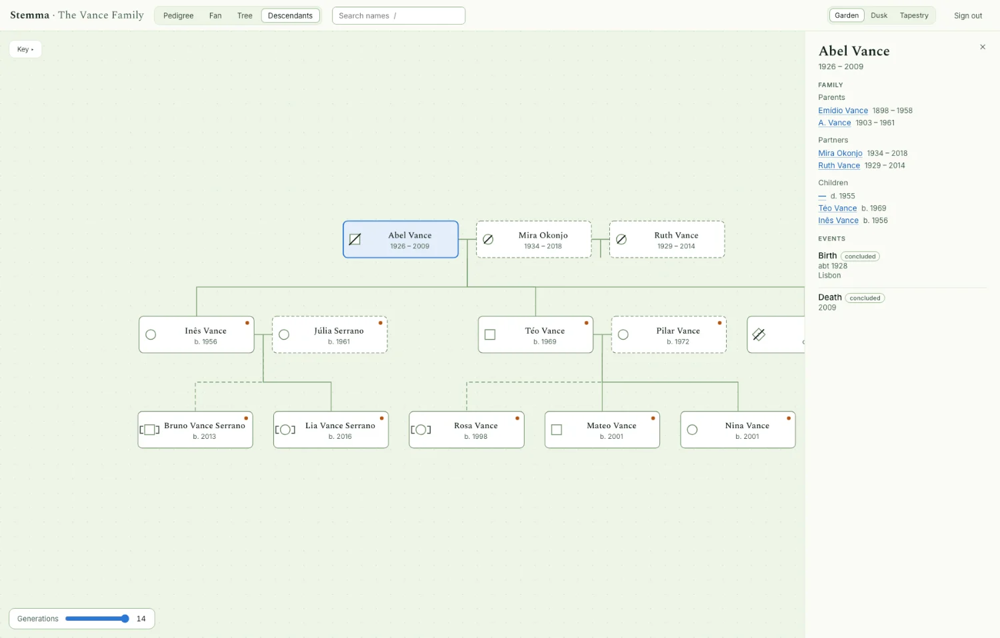
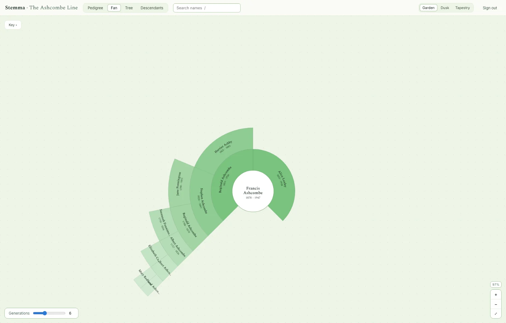
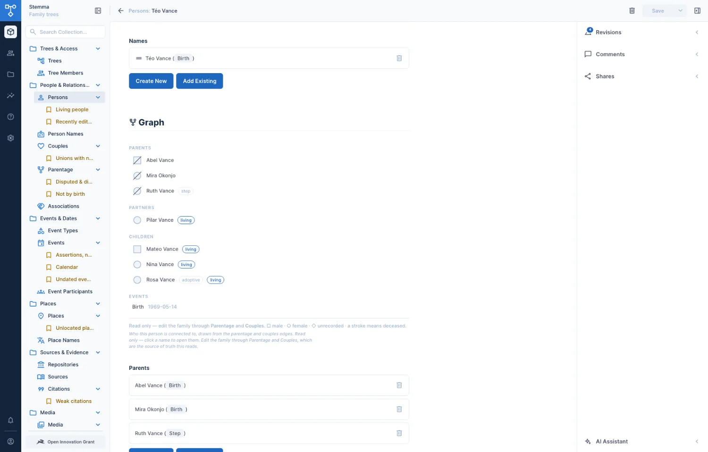
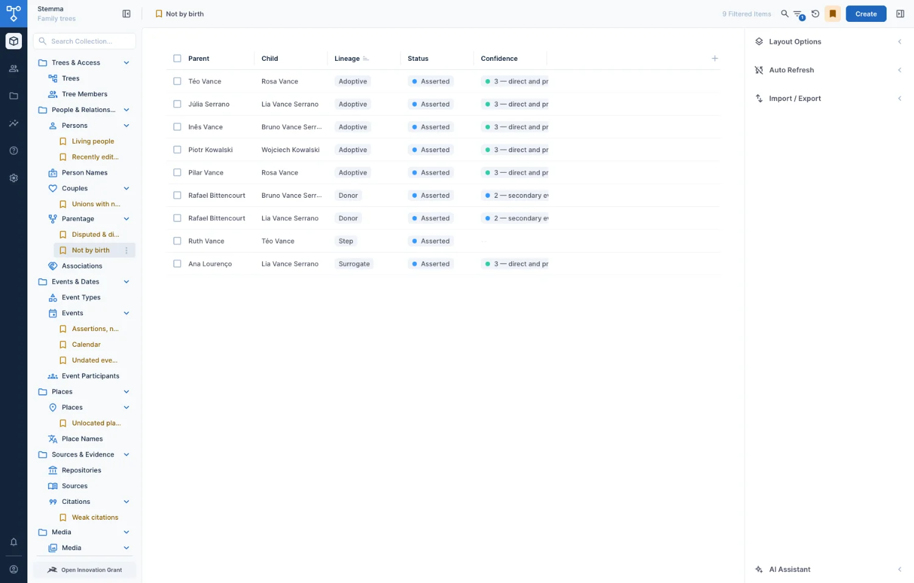

# Stemma

**A place to record a family's history properly — including all the parts that
do not fit in a neat tree.**



---

## What this is, in plain words

Most family-tree software asks you for a person, their mother and their father,
and then quietly falls apart the moment a real family turns up. People adopt.
Step-parents raise children. Couples never marry and have children anyway.
Second cousins marry each other, which means one great-grandmother ends up in
two places on the same chart. A birth certificate and a census disagree about
the year somebody was born, and both of them are evidence.

Stemma is built for those families, which is to say all of them.

You put in the people and how they are connected. It draws the family four
different ways, keeps a note of where every fact came from, hides living
relatives from anyone who should not see them, and will hand the whole thing
back to you as a standard file that Ancestry or FamilySearch can read — so
nothing is ever locked in here.

**The name.** In ancient Rome a family hung wax masks of its ancestors in the
hallway, joined by painted lines showing who descended from whom. The display
was called a *stemma*. The word survived: scholars still use a *stemma codicum*
for the family tree of a hand-copied manuscript.

**Who it is for.** This is a working reference build rather than a product you
can sign up to. There is no hosted version. If you want to run it, everything
you need is in this repository and the instructions are further down.

### What it does

|  |  |
|---|---|
| **Holds an awkward family** | Adoption, step-parents, foster placements, same-sex parents, donor conception, surrogacy, four parents on one child, cousins who married. None of these are special cases here |
| **Keeps the evidence, not just the answer** | Two records disagree about a birth year? Both are kept, each with the source it came from, and you say which one you believe and why |
| **Records dates the way sources write them** | *about 1850*, *before 1900*, *between 1852 and 1855*. The original words are never thrown away |
| **Protects living people** | Anyone still alive is hidden from public view — not just their name, but every record that would reveal them, down to the street they live on |
| **Draws it four ways** | An ancestor chart, a fan, an illustrated tree, and a descendant chart |
| **Lets you take it with you** | A single address exports the whole family as a GEDCOM file, the standard every genealogy program reads. There is no button for it in the site yet — it is a link you open |

---

## Why a family tree is not really a tree

A tree, in the everyday sense, branches outward and never joins back up. Family
trees do join back up, constantly.

If two cousins marry, their children descend from the same great-grandparents
down two different paths. That one ancestor now belongs in two places on the
chart. Genealogists call it *pedigree collapse*, and in communities where people
married locally for generations it is not unusual — it is the normal case.

So Stemma does not store a tree. It stores every relationship as its own small
fact — *this person is a parent of that person, in this way* — and works the
shape out when it draws. A person can appear twice on one chart because they
genuinely were in two places on it.

---

## What it looks like

**The pedigree** — ancestors, oldest at the top. Most genealogy software prints
this sideways; here it reads downward, the way people picture a family, so a
deep line scrolls instead of running off the edge of the page.



**The descendant chart** — everyone who came *from* a couple. Note that it lays
out couples rather than individuals: draw only blood relatives and the person
who married into the family never appears at all.



The square brackets around a name mean adopted. The dashed outline means married
in. The small dot means that person is alive, and everything about them is hidden
from the public view.

**The tree** — the same family drawn as an actual tree, with portraits hanging
from the boughs. That is the picture at the top of this page.

**The fan** — generations as rings spreading out from one person.



### Reading a chart without a key

Every fact on a chart is carried by a **shape**, never by colour alone: a square
is male, a circle female, a diamond means nobody recorded it, a diagonal stroke
means the person has died, and square brackets mean adopted. That is a published
medical standard, not an invention, and it means a chart still makes sense
photocopied, printed in black and white, or read by somebody colour-blind.
Colour is then free to be cheerful, because it is not carrying anything.

---

## The admin side

Behind the website is Directus, where the records are actually edited.

Each person's page shows their immediate family, drawn with the same symbols,
and every name is a link:



It is deliberately read-only. Everything it shows already lives in the
relationship records, and letting you edit from here would create a second way
to write the same fact.

The admin itself is set up rather than left at its defaults — collections
grouped into folders, saved views for the questions you actually ask, and a
system panel on every record that answers "who changed this, and when":



---

## Status, in numbers

For the technically minded, and checked automatically — the test suite reads
this page and fails if any figure below has drifted from the running system.

**20 collections**, 29 constraints / 52 triggers / 36 indexes in Postgres, and a
**118-check suite** that passes in both directions. A website that signs in and
renders the tree in four layouts across three themes. Three Directus extensions:
the person graph, the date parser, and GEDCOM 7 export.

Not built: the readable-error hook. An anonymous public site is a **non-goal**;
the public policy that would serve one stays, because it is what proves the
privacy boundary.

---

# How it is built

*Everything above is the product. Everything below is the engineering — the
data model, the database rules, the access model and the checks. If you came
to look at the Directus work, start here.*

---

## The one decision everything else follows from

A family tree is a **directed acyclic graph**, not a tree — which is the plain
point made above, stated the way the schema has to take it. Cousins marry,
pedigree collapse puts one ancestor in two positions of one chart, and in
endogamous communities that is the norm rather than the exception. The storage
must not care, and the renderer must cope with one person appearing several
times in one diagram.

Which rules out the schema every hobby genealogy app starts with:

```
persons(id, name, mother_id, father_id)   ← never
```

That has no answer for adoption, step-parents, same-sex parents, donor
conception, surrogacy, foster placement, disputed parentage, or a child with two
biological and two adoptive parents on record. All of those are ordinary.

Stemma follows **GEDCOM X**'s shape instead: relationships are edges, not
records that people hang off. A `parentage` row is one parent, one child, and
the nature of the link.

```
                    Jan ═══ Maria
                   ╱             ╲
               Piotr             Anna
                 │                 │
             Tomasz ═══════════ Zofia        first cousins, married
                        │
                   Katarzyna                 descends from Jan twice
```

That diagram is one of three seeded demo trees, and it is the one the test suite
runs against — because a store that assumes a tree cannot hold it at all.

| Tree | What it is for |
|---|---|
| **The Kowalski Family** | Small enough to hold in your head: pedigree collapse, an adoption, a living person, two names for one woman, conflicting birth records |
| **The Ashcombe Line** | Depth — ten generations, 1646 to 1878. A chart that looks fine at three generations is where label collisions and slow frames come from at ten |
| **The Vance Family** | Every awkward case at once: four parents on one child, two mothers with a known donor, a surrogate distinct from the donor, twins, half-siblings by two unions, one couple married-divorced-remarried, a step-parent, a disputed line, a disproven one kept on file, an unnamed infant, and a sex nobody wrote down |

---

## What is here

```
extensions/           Directus extensions
  directus-extension-person-graph/   a person's immediate family, on their own form
  directus-extension-date-parser/    abt 1850 -> four columns, never touching the original
  directus-extension-gedcom/         GET /gedcom/:slug — GEDCOM 7, families derived
apps/web/             the site: sign in, then read the tree
  app/lib/            Directus auth (httpOnly cookie) and the layout maths
  app/components/     the pan/zoom surface and the three drawings
  app/routes/         sign in · your trees · the tree · a person
directus/default/     the schema and configuration, pulled — generated, never hand-edited
bootstrap/src/
  author.ts           drives the live instance over REST: the clicks, written down
  authoring/          the collections, one module per domain
    trees.ts            trees, tree_members, tree_invitations
    graph.ts            persons, person_names, couples, parentage, associations
    events.ts           event_types, events, event_participants
    places.ts           places, place_names
    evidence.ts         repositories, sources, citations, citation_links (M2A)
    media.ts            media, media_subjects, media_links (M2A), directus_files.tree
  constraints.ts      the database rules — the part no sync carries
  access.ts           the two access paths, for all twenty collections
  presets.ts          default list views and 12 global bookmarks — the other thing no sync carries
  colour.ts           contrast and OKLab distance, shared by theme.ts and verify.ts
  brand.ts            project name, logo, favicon and the measured theme overrides
  theme.ts            contrast gates for every colour the Data Studio paints
  authoring/_theme.ts six nav folders and the one measured colour the admin uses
  seed.ts             the demo tree above, with events, places, sources and citations
  verify.ts           the check suite
  strings.ts          every operator-facing sentence, keyed for translation
docs/data-model.md    the edge-case register: what the model holds, why, and what it does not yet
docker-compose.yml    Postgres and Directus, nothing else yet
```

### The twenty collections

| | |
|---|---|
| **who may see** | `trees` `tree_members` `tree_invitations` |
| **who is in it** | `persons` `person_names` `couples` `parentage` `associations` |
| **what happened** | `event_types` `events` `event_participants` |
| **where** | `places` `place_names` |
| **how we know** | `repositories` `sources` `citations` `citation_links` |
| **what it looked like** | `media` `media_subjects` `media_links` |

Every one carries `tree`; the database checks the column agrees with every row
it points at, junctions included.

### Why the schema is pulled rather than written

Directus 12.3 ships Environment Sync. `d6s sync pull` writes collections,
fields, relations, policies, roles, flows, dashboards and translations to JSON;
`d6s sync push` applies them elsewhere, matching records across environments
through an id map, refusing to guess in CI, and gating deletions behind an
explicit flag. Hand-writing an idempotent provisioning layer on top of the
Directus API — which is what this project was originally going to do — is
rebuilding that, and rebuilding it worse.

So `directus/` is the source of truth for the shape, and `bootstrap/` holds only
what the sync structurally cannot carry. That list is short and it is the reason
the package exists:

| | carried by `d6s sync` |
|---|---|
| collections, fields, relations | ✅ |
| policies, permissions, roles | ✅ |
| flows, dashboards, translations | ✅ |
| **CHECK constraints, triggers, expression indexes** | ❌ — `constraints.ts` |
| **`directus_presets`** (bookmarks, default views) | ❌ — excluded upstream by design |
| **`directus_files`** | ❌ |
| **rows in your own collections** | ❌ — `seed.ts` |
| **any proof that the above is correct** | ❌ — `verify.ts` |

The reasoning behind each field has not been lost to a generated dump. Notes and
labels are `$t:` keys resolved from `directus_translations`, which *is* carried
by the sync — so the argument for `couples` over `marriages` reaches every
environment along with the column.

---

## The site

Signed-in members only — a Directus login, with the access token in an httpOnly
cookie that no script on the page can read. That matters more here than usual:
the token reads every living relative in every tree the member belongs to, and
the whole point of the access model is that those people are not published.

Three themes, and four layouts of one person on one keystroke each.

### Three themes

| | |
|---|---|
| **Garden** | Bright and green — the default |
| **Dusk** | The same garden at night |
| **Tapestry** | Gold thread on a blackened green ground: names in chamfered cartouches with a second rule inside the first, a lozenge at each corner, and a pearl at the crown for the living |

Tapestry is ornate on purpose and held to exactly the same contrast floor as
the other two. The ground is not black — a true black makes gold read as yellow
plastic, where a very dark desaturated green reads as dyed wool and lets the
metal sit on it. The cartouche is a chamfered octagon rather than a rounded
rectangle because a curve in gold thread has to be stepped anyway, so woven
heraldry cuts corners instead of rounding them; it also has no arcs in it, which
is why 4,616 of those shapes still hold 60fps.

### Layouts

| | |
|---|---|
| **Pedigree** `1` | Ancestors above, subject below — vertical, oldest at the top |
| **Fan** `2` | Ancestors in rings, colour fading into the past |
| **Tree** `3` | An actual tree: a trunk, tapered boughs, leaves, and a face in each medallion |
| **Descendants** `4` | Families, not just bloodlines — see below |

Everything except the fan reads **top to bottom, oldest first**, so the eye
travels the same way in every chart and a deep tree scrolls rather than running
off the side of the page.

### The people who married in

A descendant chart that draws one person per node is a list of blood relatives:
the person who married into the family — half of every couple in it — simply
does not appear. So the unit of layout there is the **couple**, not the person.

- a **union bar** joins partners, and whoever married in is drawn dashed
- children hang off the union they belong to, so a man with two wives has two
  sets of children rather than one shared brood
- a **doubled bar** means the partners are also related by descent — the
  pedigree standard's mark for consanguinity, and the thing that explains why
  an ancestor turns up twice further up the chart
- a family is drawn **once**: when two people who both descend from the root
  marry, the second occurrence is marked *also above* rather than repeating the
  whole branch

Families are derived at render time from `couples` and `parentage`. GEDCOM makes
a `FAM` record the stored node and hangs people off it; this schema deliberately
does not, for the reasons at the top. But a *drawing* does need families — the
same argument as siblings, which are derived and never stored.

### Portraits

`persons.portrait` holds a face, served through the app rather than straight
from Directus, because the token that authorises it lives in an httpOnly cookie.
Where there is no picture the chart falls back to initials, which is what most
of a real tree looks like. The demo's portraits are silhouette cameos rather
than faces: demo data for a family archive should not contain pictures of people
who do not exist and cannot consent.

Plus `f` to fit, `/` to search, `+`/`−` to zoom, `Esc` to dismiss. Click any
person for their names, family, events — including two conflicting birth
records with one marked *concluded* — biography and citation count. Click
*Centre the chart here* to re-root.

The same person appears more than once when the lines converge, which is
pedigree collapse drawn honestly rather than papered over; selecting one
position highlights all of them.

### What the chart tells you without a legend

Every fact that matters is carried by **shape, stroke or bracket — never by
colour alone**, using the [NSGC standardized pedigree
nomenclature](https://www.nsgc.org/) (Bennett et al., 2022):

| | |
|---|---|
| □ square · ○ circle · ◇ diamond | male · female · intersex; a diamond with `?` means sex was not recorded |
| a diagonal stroke | this person has died |
| `[` brackets `]` | adopted |
| solid line | birth parent |
| dashed line | adoptive parent |
| dotted line | step · foster · guardian |

That choice does real work. A genealogist or a genetic counsellor reads it
without being taught; it survives a photocopier and every kind of
colour-blindness; and it avoids the usual convention for sex, which is pink and
blue — both a stereotype and invisible to the commonest CVD.

`sex_recorded` is what a document recorded, never a claim about identity. The
column is named that way for the same reason.

Colour is then free to do something cheerful: in the Tree it marks **which line
you descend through**, and in the Fan it fades into the past.

### Colour is computed, not picked

Two rules decided the palette, and both came out of running the numbers rather
than looking at swatches.

**Generations are ordinal, so they take one hue with monotone lightness** — not
a rainbow. Order is read from lightness; a hue per ring spends the identity
channel on something position already says.

**Branch tints cap at three.** Four categorical hues **fail** the normal-vision
separation floor — yellow against orange measures ΔE 13.7, below the 15 needed
for full-colour readers to tell them apart at all. Three clears every gate under
all-pairs (worst ΔE 24.0 normal, 9.2 simulated CVD). A fourth line falls back to
neutral rather than get an invented colour.

### Readability is a check, not an opinion

The first version of this theme **failed WCAG AA in 45 places** across two
themes, and the worst of them were the dates — `--ink-faint` sat at 3.65:1
against paper, and it painted every year, every place and every section
heading. A genealogy interface is four-fifths dates, so the least readable
thing on screen was the thing people came to read. The "Recorded as living"
note, which exists to explain a privacy rule, was at 2.61:1.

Nobody catches that by looking. So it is measured:

```bash
pnpm contrast
```

It drives a real browser, walks every element that renders text in every theme
and every layout,
resolves the colour actually painted — including SVG `fill` and `color-mix`,
which Chrome serialises as `oklab()` — and fails if anything sits below 4.5:1
for body text or 3:1 for large text. All three themes pass. Reverting one token
turns three sections red, which is how the check was shown to be capable of
failing at all.

### Making it smooth

Three things, and two of them were found by measuring rather than reasoning.

**React never re-renders during a pan or zoom.** d3-zoom writes a CSS transform
straight to one wrapping `<g>` through a ref. That part was reasoned.

**`will-change: transform` made it fourteen times worse.** The standard advice
is to promote the layer up front so the first drag frame has no hitch. On a
`<g>` holding four thousand nodes it instead asks Chrome to keep a texture the
size of the entire drawing and re-raster it on every scale change. Measured p95
went from 33ms to **1133ms** — a visible one-second freeze mid-zoom. Removing it
was the single biggest win in the app.

**Only about 6% of nodes are ever on screen**, so the box layouts render just
the visible rectangle, padded by most of a viewport so an ordinary pan is still
zero React renders. The fan instead spends a wedge budget outward: a *full*
pedigree doubles every ring and stops at seven, a real one — mostly gaps by the
fifth generation — gets all twelve and never notices the limit exists.

Measured on a synthetic 4,095-person tree, twelve full generations, 1440×900:

| | p50 | p95 | worst | under 20ms |
|---|---|---|---|---|
| Pedigree, wheel zoom | 16.7ms | 16.8ms | 33ms | 99% |
| Pedigree, drag pan | 16.7ms | 16.7ms | 16.8ms | 100% |
| Fan, wheel zoom | 16.7ms | 33.3ms | 50ms | 95% |
| Tapestry pedigree (4,616 shapes) | 16.7ms | 16.8ms | 67ms | 99% |

Real trees sit entirely inside the flat part of that.

---

## The person graph

A custom Directus **interface** on the person form: parents, partners and
children drawn from the edges, with the pedigree symbols, navigating on click.
The screenshot is [further up](#the-admin-side).

It stores nothing — the field is an alias with no column, because everything it
draws is already in `parentage` and `couples`, and a second copy would be a
second source of truth. It reads through the injected `useApi()`, so every
request is filtered by the signed-in user's own permissions rather than
bypassing them with a bare `fetch`.

See [its README](extensions/directus-extension-person-graph/) for the rest.

---

## Rules that live in Postgres

A rule enforced in application code holds for the clients that go through that
code. A rule enforced by the database holds for every client there will ever be
— the Data Studio, a flow, the website's token, a `psql` session, a static token
somebody minted last year and forgot.

- **No person may be their own ancestor.** A `BEFORE INSERT OR UPDATE` trigger
  on `parentage` running a recursive CTE up from the proposed parent. It uses
  `UNION` rather than `UNION ALL` so the walk terminates even over data that
  already contains a cycle — the guard cannot be defeated by the situation it
  exists to prevent.
- **A couple is unordered.** `(a, b)` and `(b, a)` are one union, enforced by a
  unique index on `LEAST`/`GREATEST` of the pair. Normalising the order on write
  was the alternative, and it holds only for writers that remember.
- **A row's `tree` must agree with the rows it points at.** `tree` is
  denormalised onto every collection so the public filter is one hop. That
  column is load-bearing for access control: a `parentage` row stamped with a
  public tree, whose people are in somebody's private one, would be served to
  strangers by a filter working exactly as designed.
- **`persons.display_name`** and **`sort_name`** follow the name list, lowest
  `sort_order` first, in the name's own order (given-first or surname-first) and
  with the particle sorted per the tree's convention — *Gogh, Vincent van* in a
  Dutch tree, *van Gogh, Vincent* in a Belgian one. Caches, not second sources
  of truth.
- **Who may add to a tree is decided here too.** Directus cannot say it: its
  create validation is a flat check on the payload, so a rule about membership
  is unwritable there. `stemma_writer_is_member` reads `user_created` against
  `tree_members` before the row lands.
- **A death ends a life.** An event whose type `ends_life` switches the subject's
  `is_living` off and records why. Deleting the record does not undo it.
- **Descent is acyclic; affinity is not.** Only birth, adoptive, donor and
  surrogate edges are walked — a step edge may close a loop, because "I'm my own
  grandpa" is a family, not an error.
- **The visibility booleans the policy reads are computed on write.**
  `events.has_living_participant`, `places.has_public_reference`,
  `citation_links.is_public_ok`, `directus_files.is_public_ok` — each a join,
  run once into a column, fanned out when a person's flags change.
- **Two disciplines, both learned the hard way.** A trigger that checks before
  it writes takes a per-tree advisory lock — the acyclicity check was raced into
  accepting a cycle under `READ COMMITTED`. A trigger that writes to its own
  table is column-specific — the events visibility trigger recursed until the
  stack ran out.

---

## Two access paths, deliberately separate

An anonymous visitor has no membership, so they are not routed through one.

```jsonc
// public — two flat booleans, and nothing else
{ "_and": [ { "tree": { "is_public": { "_eq": true } } },
            { "is_living": { "_eq": false } } ] }

// contributors — relational, many-to-many
{ "tree": { "members": { "user": { "_eq": "$CURRENT_USER" } } } }
```

Every *row that names a living person* is filtered, not just the person: the
edge to their dead mother (it gives her maiden name — one of the three answers a
bank asks for), the census they appear in as a household member, the witness
line, the citation that supports only them, the street known only from their
residence. Where the honest answer is a join, a trigger computes it into a
boolean and the filter compares the boolean. Restricted people (`is_restricted`
— a family's wish, not a legal status) are hidden the same way.

Conflicting evidence, by contrast, is *shown*: an anonymous visitor sees both of
Jan Kowalski's birth records, one marked the conclusion.

Everyone who signs in holds one Directus role, **Member**. What they may do in a
given tree is read off `tree_members.role` inside the filter — because a
Directus role is global and a person's standing is not. The same user owns their
own tree and merely views their cousin's.

---

## Checks

`pnpm verify` asserts both directions, and sabotages a live instance inside a
transaction to prove each rule bites rather than merely existing in a catalogue
— 99 checks, including one that opens two connections and races them. One rule
beyond that is worth stating, because it is the trap this suite is built
around:

> **A check that could not run is reported as a failure, never as a pass.**

"An anonymous visitor cannot see the living person" passes trivially if the
public policy grants nothing at all — the visitor sees nobody, so they certainly
do not see her. A green tick there would report a working privacy boundary where
there is in fact no public site. So every negative check is gated on a positive
one demonstrating the public read works, and reports `????` otherwise.

---

## Running it

Every dependency, Docker image and GitHub Action is pinned to an exact version
— images by digest, actions by commit — so an install reproduces the build this
was tested against.

```bash
cp .env.example .env          # then fill in the secrets it names
docker compose up -d
pnpm install
pnpm build:extensions         # Directus loads dist/ at boot, so this comes first

pnpm build                    # the collections, into the live instance
pnpm rules                    # the database rules — must follow the schema
pnpm policies                 # the access model  (needs the licence key)
pnpm brand                    # name, logo, favicon, theme overrides
pnpm presets                  # default list views and the global bookmarks
pnpm seed                     # the demo tree
pnpm verify                   # both directions, 118 checks
pnpm theme                    # every admin colour, against the surface it sits on

pnpm web                      # the site, on http://localhost:8060

pnpm --filter @stemma/web demo:snapshot   # freeze the demo trees to JSON
pnpm --filter @stemma/web demo:build      # prerender them — no server, no sign-in
pnpm contrast                 # WCAG AA across all three themes
```

On a fresh environment built from the sync files, `d6s sync push` replaces
`pnpm build`; the other steps are unchanged, and `rules` **must** run before
anyone writes — until it does the instance accepts cycles. `brand` stays a
step of its own because the sync carries `directus_settings` but not
`directus_files`, so the settings row would arrive pointing at two file ids
that environment has never seen.

Directus is on <http://localhost:9057>. Demo accounts share one password, set by
`DEMO_PASSWORD`.

To change the schema: change it in the Data Studio, then `pnpm pull` to capture
it and commit the diff. `pnpm diff` shows what a push would do first.

### A licence key is required

Not optional, and not only for polish. This instance runs at the Open
Innovation Grant tier and every rule applies; at core tier Directus 12 answers
any permission carrying a filter with:

```
custom_permission_rules_enabled is a restricted resource.
```

Every rule in `access.ts` carries a filter, because a rule without one grants
everything. Core tier also caps the instance at 3 seats and 25 collections.

Worse for this project specifically: `d6s sync pull` against an unlicensed
instance **silently drops custom permission rules that use filters**, so the
committed sync files would be missing the only thing protecting living people.

It is free under the [Open Innovation Grant](https://directus.com/docs/licensing/open-innovation-grant)
for organisations under $5M revenue and 50 staff. Put it in
`DIRECTUS_LICENSE_KEY` and recreate the container.

---

## Explicit non-goals

- **Cross-tree person matching.** If two users' trees both contain the same
  great-grandmother, those are two rows and Stemma does not know they are the
  same woman. The "one world tree" problem is what FamilySearch and Ancestry
  have spent decades and enormous sums on. Different product.
- **DNA matching.** Centimorgan segment analysis is its own discipline.
- **Record hints and search.** Requires a licensed records corpus, not code.
- **GEDCOM import**, at first. Export is a weekend; import is months, because
  every vendor's GEDCOM is subtly non-conformant and you inherit their mistakes.
- **Person merge** and **collaborative editing**, until they are known to be the
  product.

---

## Licence

**[PolyForm Strict 1.0.0](https://polyformproject.org/licenses/strict/1.0.0/)** —
see [LICENSE](LICENSE). Copyright (c) 2026 Ahmad Khan.

You may use this for any **noncommercial** purpose: read it, run it, study it,
use it for your own family's tree. You may **not** distribute it, and you may
**not** make changes or new works based on it. Any commercial use needs a
separate licence — write to ahmad@khanahmad.com.

It is a lawyer-drafted standard licence rather than a hand-written one, and
SPDX-recognised, so tooling reports it properly.

Dependencies keep their own licences (predominantly MIT). Directus is a
separate program under MSCL-1.0-GPL; Stemma talks to it over HTTP and neither
bundles nor modifies it.
