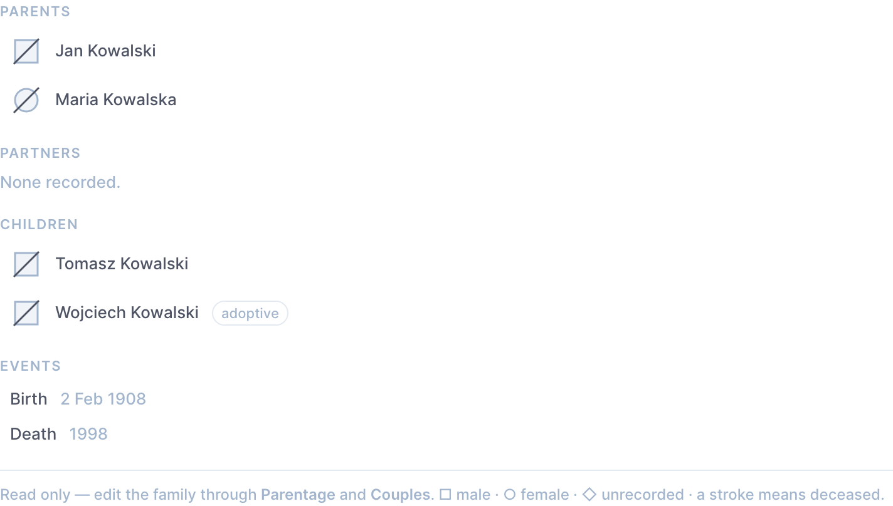

# Person graph

A Directus **interface** that draws a person's immediate family on their own
form: parents, partners and children, with the standard pedigree symbols, and
navigates to any of them on click.



## Why it exists

The commonest thing a contributor does is arrive at a person and ask *who is
this connected to, and is that right?* Answering that through the relational
lists means reading four tables of raw rows. The Data Studio is where the
editing happens, so the navigation belongs there too.

## What it does not do

**It stores nothing.** The field is an alias with `special: ["alias",
"no-data"]` and no column, because everything on screen is already in
`parentage` and `couples`; a second copy would be a second source of truth.
Editing stays in those collections.

## Two details worth knowing

`useApi()` is injected by the app and already carries the signed-in user's
credentials, so every read is filtered by that person's own permissions — a
viewer of one tree cannot pull a relative out of another through this
interface. A bare `fetch` would have bypassed that.

`primaryKey` is `"+"` while the item is new. There is no graph to draw for a
person who does not exist yet, and asking for `/items/persons/+` returns a 403
that looks like a permissions bug.

## The symbols

□ male · ○ female · ◇ sex not recorded · a diagonal stroke means deceased.
Those are the [NSGC standardized pedigree
nomenclature](https://www.nsgc.org/) (Bennett et al., 2022), the same set the
public site uses — never colour, so they survive a printer and every kind of
colour-blindness.

## Building

```bash
pnpm --filter directus-extension-person-graph build   # or: pnpm build:extensions
```

`docker-compose.yml` mounts `./extensions` into the container, so Directus
picks up `dist/` on restart.

## Licence

PolyForm Strict 1.0.0 — see [LICENSE](./LICENSE). Noncommercial use only; no
distribution, no derivative works. Commercial use: ahmad@khanahmad.com.
